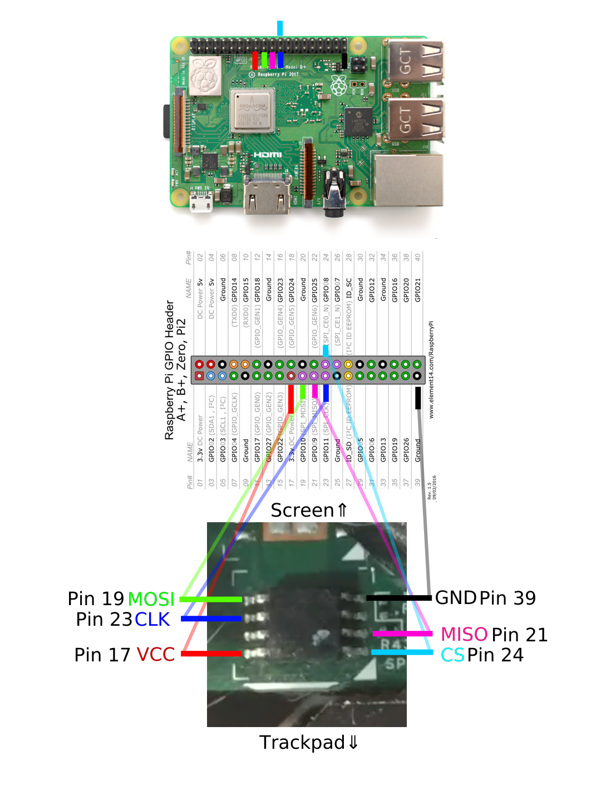

# Flash Coreboot on a Thinkpad X220

This repository is a supplement for [my x220 coreboot flash guide on YouTube](https://youtu.be/kJRgBlXRy5I).

While highly unlikely, it is possible to brick your x220 while attempting to flash
coreboot. I take no responsibility if that horrible and unfortunate event were to
occur, so do this at your own risk.

*You can always re-flash your old BIOS. (**Keep backups!**)*


## Setup

#### Enable SPI Interface
```
sudo raspi-config

# Choose "[5] Interfacing Options"
# Then choose "P4 SPI" and "Yes" to enable
# Then reboot the pi
reboot
```

#### Update packages index
```sh
sudo apt update
```

#### Install flashrom
```sh
sudo apt install flashrom
```

#### Install other dependencies
```sh
sudo apt install build-essential git libftdi1 libftdi-dev libusb-dev \
  libpci-dev m4 bison flex libncurses5-dev libncurses5 pciutils \
  usbutils libpci-dev libusb-dev zlib1g-dev \
  libusb-1.0 gnat-4.9
```

#### Clone coreboot repo and submodules
```sh
git clone --recurse-submodules https://review.coreboot.org/coreboot.git ~/coreboot
```

#### Compile ifdtool
```sh
cd ~/coreboot/util/ifdtool
make && sudo make install
```

#### Clone me_cleaner repo (Optional)
```sh
git clone https://github.com/corna/me_cleaner ~/me_cleaner
```


## Pinout



You will need six jumper wires for VCC, MOSI, MISO, CLK, CS, and GND.  
*Note: VCC is 3.3 volts.*

## Read and Verify

#### SPI speeds and alias
```sh
# `spispeed=512` can be set to a higher value for faster reading and
# writing, but slower rw speeds are generally more robust.
# for reference: an spispeed of 512 took roughly 3m40s per read.

# optional: fr alias for flashrom, less typing
alias fr='sudo flashrom -p linux_spi:dev=/dev/spidev0.0,spispeed=512'
```

#### Find flash chip name
```sh
# Print all flash chips
fr

# Multiple chips may be found, you probably can choose any of them. Be sure
# to read and compare checksums for each of them just in case.
```

#### Read flash chip to determine if connection is OK
```sh
# If multiple chips were found, use a seperate one for each read.
# The `time` command is optional, but it is nice to know how long it takes. 
mkdir ~/rom
cd $_

# Read the flash 4 times, you can do it fewer times.
CHIP="YOUR CHIP NAME HERE"
time fr -c "$CHIP" -r flash01.bin
fr -c "$CHIP" -r flash02.bin
fr -c "$CHIP" -r flash03.bin
fr -c "$CHIP" -r flash04.bin
```

#### Compare checksums
```sh
# Assure all checksums are the same!
# If they're not, check out https://www.coreboot.org/Board:lenovo/x220 for
# troubleshoooting; DO NOT CONTINUE.
md5sum flash01.bin flash02.bin flash03.bin flash04.bin

```
*If all checksums are the same, then backup `flash01.bin` to **AT LEAST** one safe location.*

## Blobs

#### Run me_cleaner (Optional)
Run `me_cleaner` with `-S` option to enable the HAP AltMeDisable kill-switch and remove the extra code from the firmware.
```sh
~/me_cleaner/me_cleaner.py -S flash01.bin
```

#### Extract with idftool
```sh
cd ~/rom
ifdtool -x flash01.bin
```

#### Copy/move blobs
```sh
mkdir -p ~/coreboot/3rdparty/blobs/mainboard/lenovo/x220
cd $_

cp ~/rom/flashregion_0_flashdescriptor.bin descriptor.bin
cp ~/rom/flashregion_2_intel_me.bin me.bin
cp ~/rom/flashregion_3_gbe.bin gbe.bin
```


## Coreboot

Consider copying `~/coreboot` to a faster machine for compiling. Otherwise, the
Raspberry Pi will take multiple hours to build.

#### Configure coreboot
To run Windows, SeaBIOS may need a VGABIOS firmware. You can extract it yourself by
following [this guide](https://www.coreboot.org/VGA_support)
--OR-- you can use the pre-extracted one below.
```sh
# Optional: download pre-extracted vgabios firmware.
wget https://github.com/thetarkus/x220-coreboot-guide/raw/master/vga-8086-0126.bin

cd ~/coreboot
make nconfig

### Coreboot configuration
General
  [*] Compress ramstage with LZMA
  [*] Include coreboot .config file into the ROM image
  [*] Allow use of binary-only repository

Mainboard
  Mainboard vendor (Lenovo)
  Mainboard model (ThinkPad X220)

Chipset
  [*] Enable VMX for virtualization
  [*] Add Intel descriptor.bin file
      (3rdparty/blobs/mainboard/$(MAINBOARDDIR)/descriptor.bin) Path and filename
  [*] Add Intel ME/TXE firmware
      (3rdparty/blobs/mainboard/$(MAINBOARDDIR)/me.bin) Path to management engine firmware
  [*] Add gigabit ethernet firmware
      (3rdparty/blobs/mainboard/$(MAINBOARDDIR)/gbe.bin) Path to gigabit ethernet 

Devices ***if using the VGABIOS firmware***
  [*] Graphics initialization (Run VGA Option ROMs)
  [*] Add a VGA BIOS image
      (<PATH TO VGA BIOS IMAGE>) VGA BIOS path and filename
      (8086,0126) VGA device PCI IDs
  [*] Add a Video Bios Table (VBT) binary to CBFS

Generic Drivers
  [*] PS/2 keyboard init

Console
  [*] Show POST codes on the debug console

Payload
  Add a payload (SeaBIOS) --->
  SeaBIOS version (master) --->
  [*] Hardware init during option ROM execution
###
```

#### Build coreboot
```sh
make
# Will be placed into `~/coreboot/build/coreboot.rom`.
```

Or, in case you are running make from your raspberry pi, do:
```sh
make crossgcc-i386 CPUS=4
make iasl
make
```
The above commands will take a couple of hours. If your raspberry pi runs out of memory like mine, then create a swapfile https://digitizor.com/create-swap-file-ubuntu-linux/

## Write coreboot to flash chip

#### Re-read flash chips to determine if connection is still OK
See [previous section](#read-flash-chips-to-determine-if-connection-is-ok).
```sh
fr -c "$CHIP" -r a.bin
fr -c "$CHIP" -r b.bin

# Assure these are still the same!!!
md5sum a.bin b.bin
```

#### Write coreboot to flash chip... the moment of truth
```sh
cd ~/coreboot/build
fr -c "$CHIP" -w coreboot.rom

# Getting "Erasing and writing flash chip... FAILED" once is normal. Do not panic.
```

#### Finale
* If successful, turn off the Raspberry Pi by running `sudo shutdown now` before
removing connections.
* If not successful, you can check your connection and attempt to re-flash.
* If still not successful, re-compile coreboot and re-flash.
* If STILL not successful and you feel like giving up, you can re-flash `flash01.bin`.

## FAQ and Common Issues
- I'm getting "No EEPROM/flash device found" when trying to read the BIOS rom.
Make sure that you've enabled SPI and run `ls /dev | grep spi` to confirm that your SPI devices are detected properly. If they do not appear it may have to do with your kernel. Download and flash latest Raspbian Lite and follow the tutorial from the start.

- `make` fails as the blobs folder is not empty. Resulting in an error similar to:
  ```
  Microcode error: 3rdparty/blobs/cpu/intel/model_206ax/microcode.bin does not exist Microcode error: 3rdparty/blobs/cpu/intel/model_306ax/microcode.bin does not exist src/cpu/Makefile.inc:40: error execution recepie for target «build/cpu_microcode_blob.bin» make: ** [build/cpu_microcode_blob.bin] Error 1
  ```

  A solution may be to clone 3rd party blobs from coreboot
  ```sh
  cd ~/coreboot/3rdparty
  git clone http://review.coreboot.org/blobs.git
  # resource: https://www.reddit.com/r/coreboot/comments/7y6nqo/missing_microcode/
  ```

## Other Helpful Information
* coreboot's [wiki page](https://www.coreboot.org/Board:lenovo/x220)
* tripcode!Q/7's [video](https://www.youtube.com/watch?v=ExQKOtZhLBM)
* Tyler Cipriani's [blog post](https://tylercipriani.com/blog/2016/11/13/coreboot-on-the-thinkpad-x220-with-a-raspberry-pi/)
